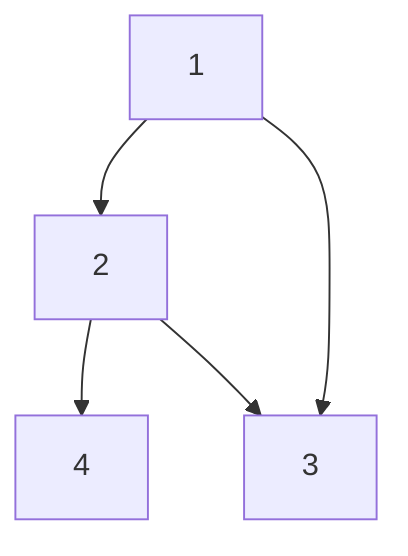
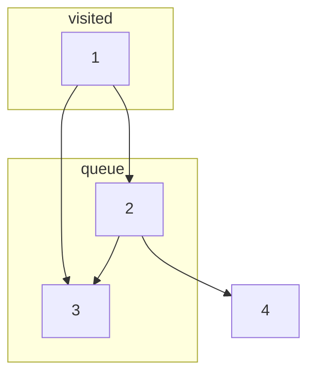
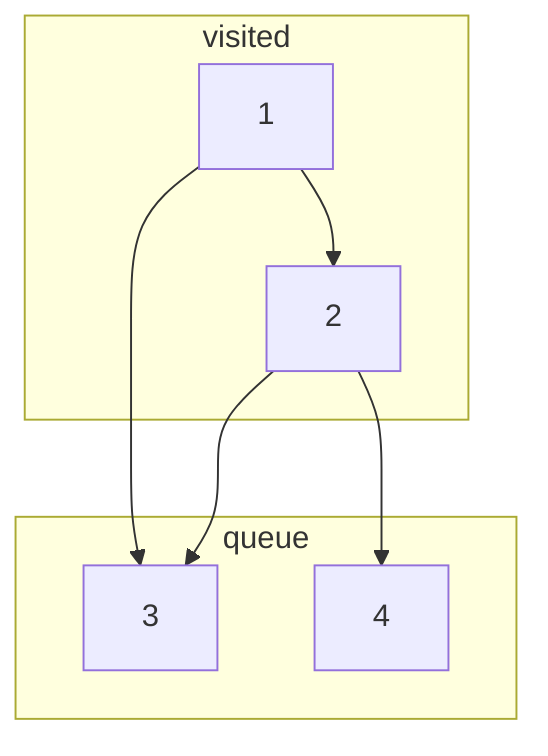
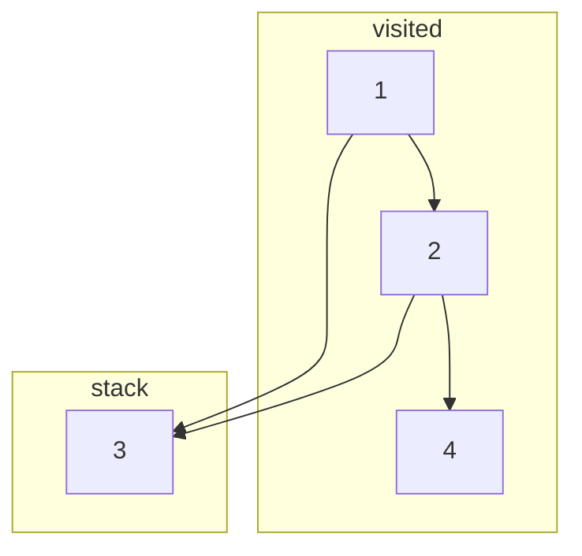
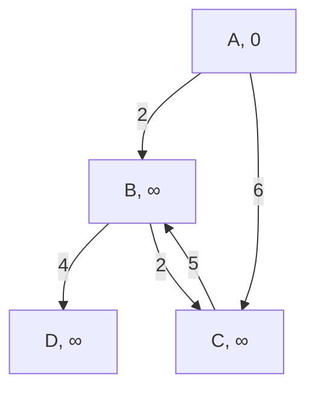
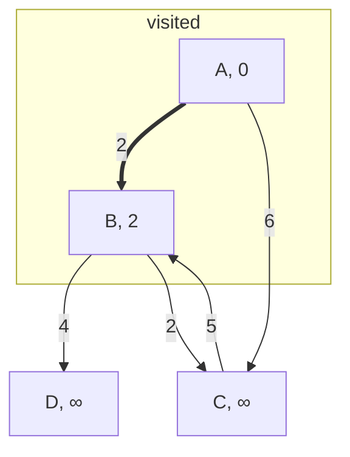
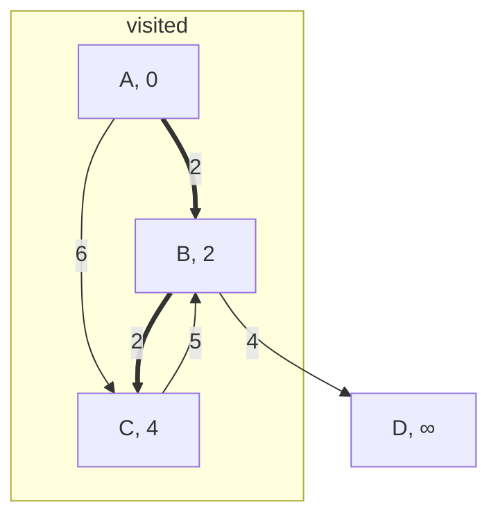
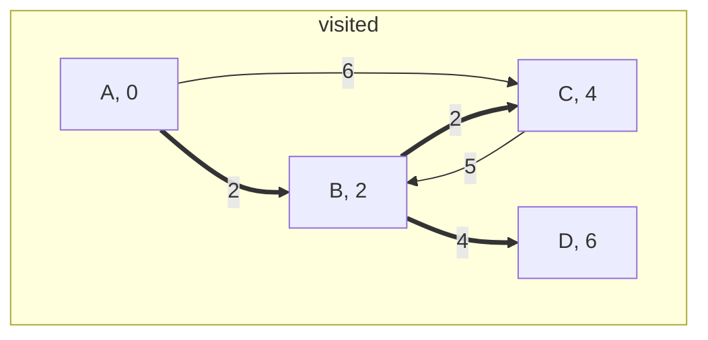
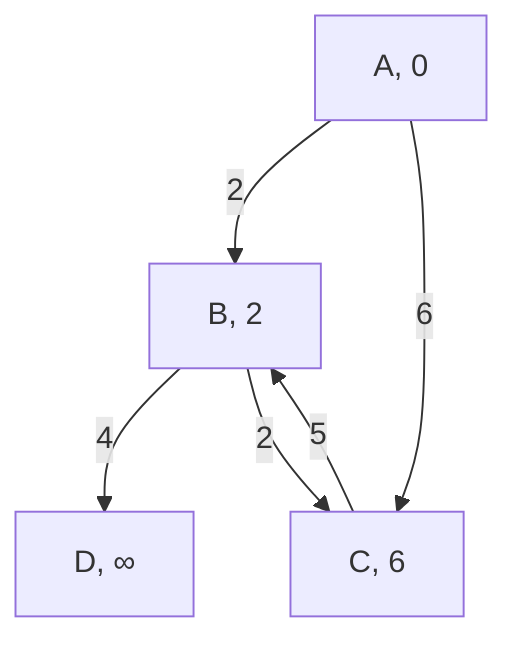
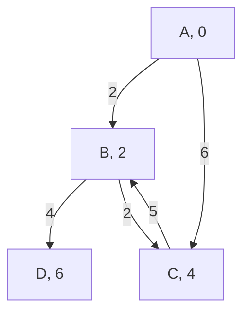

# Graph-Algorithms
Explanation and implementation of a bunch of different graph-related algorithms.

## Table of Contents
* [Graph Representation](#graph-representation)
    - [Vector of Vertices](#vector-of-vertices)
    - [Adjacency Matrix](#adjacency-matrix)
    - [Adjacency List](#adjacency-list)
    - [Edge List](#edge-list)
* [Traversal](#traversal)
    - [Breadth-Frst Search](#breadth-first-search)
    - [Depth-First Search](#depth-first-search)
* [Shortest Path](#shortest-path)
    - [Dijkstra](#dijkstra)
    - [Bellman-Ford](#bellman-ford)
    - [Floyd-Warshall](#floyd-warshall)
* [Topological Sorting](#topological-sorting)
    - [Using DFS](#using-dfs)
    - [Kahn's Algorithm](#kahns-algorithm)
* [Minimum Spanning Tree](#minimum-spanning-tree)
    - [Kruskal](#kruskal)
    - [Prim](#prim)
* [Strongly Connected Components](#strongly-connected-components)
    - [Tarjan's Algorithm](#tarjans-algorithm)


## Graph Representation
  A graph is a structure made up of vertices and edges. Vertices, also known as nodes, are connected through the edges. There are many ways to represent a graph in programming, and choosing the right one depends on your purpose. In the code of this repository, I will be using a vector composed of the nodes of the graph, where each node will be represented using a custom struct. However, there are also other ways to accomplish the same thing, each with its own advantages and disadvantages.

### Vector of Vertices
  A vector of vertices is what I am going to be using throughout this repository. Basically, I created a struct to act as a node which holds its value, a pointer to each neighbouring node as well as the weight of the edge connecting them and a way to add edges from one node to another. The code for the node is the following:
  
```c++
class Vertex {
    private:
        int value;
        std::vector<std::pair<Vertex*, int> > nextVertex;
    public:
        void val(int v) {
            value = v;
        }
        
        int val() {
            return value;
        }

        void add(Vertex* n, int w) {
            nextVertex.emplace_back(n, w);
        }

        Vertex* adj(int i) {
            return nextVertex[i].first;
        }

        int weight(int i) {
            return nextVertex[i].second;
        }

        int len() {
            return nextVertex.size();
        }
};
```

### Adjacency Matrix
  An adjacency matrix is basically a 2D board of size VxV where V is the amount of vertices present in the graph. A number is given to each vertex and the place [i][j] in the board symbolises that there is an edge connecting node i and j. In cases where the weight of all edges is constant then a simple 2D boolean board would be enough, however, in cases with varying weights it is necessary to replace booleans with an integer symbolising the weight of the edge, and having some kind of default value to represent an absece of an edge.<br>
As I am using the vector of vertices, I created a function which converts such a structure to an adjacency matrix.
```c++
std::vector<std::vector<int> > get_adjacency_matrix(std::vector<Vertex*> g) {
    std::vector<int> temp(g.size(), std::numeric_limits<int>::max());
    std::vector<std::vector<int> > r(g.size(), temp);
    for (int i = 0; i<g.size(); i++) {
        r[i][i] = 0;
        for (int j = 0; j<g[i]->len(); j++) {
            r[i][g[i]->adj(j)->val()] = g[i]->weight(j);
        }
    }
    
    return r;
}
```
  While the adjacency matrix produced is much faster than any other structure which could be used as it offers constant look-up time, it lacks in the department of space complexity as it is $O(V^2)$, with V being the number of vertices.
  
### Adjacency List
An adjacency list consists of a list of vectors where each ith place in the list represents one vertex. In each slot, there is a vector which holds all of the neighbours by using the `std::pair` and holding the index of the node and the weight required to reach it. To transform from a vector of vertices to an adjacency list you could use the following code:
```c++
std::vector<std::vector<std::pair<int, int> > > get_adjacency_list(std::vector<Vertex*> g) {
    std::vector<std::vector<std::pair<int, int> > > r;
    for (int i = 0; i<g.size(); i++) {
        for (int j = 0; j<g[i]->len(); j++) {
            r[i].emplace_back(g[i]->adj(j)->val(), g[i]->weight(j));
        }
    }
    
    return r;
}
```
This method of storing a graph is quite efficient and actually pretty similar to the method used in this repository. Its lookup time is at worse $O(V)$, where V is the number of nodes, however, it is practically less and it is usually much more space-efficient than the adjacency matrix, with space complexity of $O(E)$, where E is the number of edges. Of course, E can be at worse equal to $V^2$, but usually, that is not the case. So even though the adjacency matrix and list may at first glance take up the same amount of space, the fact that the list version uses vectors with adjustable length contributes to an overall decrease in size by increasing some of its time complexity.

  ### Edge List
Finally, another popular method of storing graphs is the edge list. Basically, with this method you store in a list all of the edges present in the graph without caring about the nodes. Each edge in this list is represented by three values, two of them are the values of the two vertices connected and the final one is the weight of the edge. To accomplish this I just created another custom struct. The code for the conversion between the vector of vertices and the edge list is:
```c++
struct edge {
    int a, b, w;
};

std::vector<edge> get_edge_list(std::vector<Vertex*> g) {
    std::vector<edge> r;
    for (int i = 0; i<g.size(); i++) {
        for (int j = 0; j<g[i]->len(); j++) {
            edge e;
            e.a = g[i]->val();
            e.b = g[i]->adj(j)->val();
            e.w = g[i]->weight(j);
            r.push_back(e);
        }
    }
    return r;
}
```
With this way of storing, nodes with no edges will be completely ignored, which is quite the drawback in certain cases and it even has a space and time complexity of $O(E)$, where E is the number of edges. However, its main strength stems from its easy-to-manipulate order of the edges, making it extremely useful in some cases such as in [Kruskal's Algorithm](#kruskal).

## Traversal
Graph traversal refers to the process of visiting all nodes in a graph. This process can be carried out for a multitude of reasons, such as searching for a specific node. Two of the most popular techniques in accomplishing this are Breadth-First Search and Depth-First Search.

### Breadth-First Search
Breadth-First Search, also known as BFS, is a traversal algorithm. It works by starting its search at a single node, marking it as visited, and then, using a queue, adds all unvisited neighbours of the node to the queue. Then, the next vertex is taken from the queue and the process repeats until the queue becomes empty. For instance, if we had the following graph:

If we call BFS on this graph, starting at node 1, then the algorithm will mark node 1 as visited and add node 2 and 3 to its queue.

Then it will access the queue. Let's say that node 2 was added first. That means that node 2 is marked as visited and then node 4 is added to the queue. However, node 3 has already been added to the queue and is therefore not added again. So the graph will now look like this:

Then, node 3 is accessed and marked as visited, however, it has no neighbours to add to the queue. Then, the loop runs again one final time for node 4 which is also marked as visited and with no neighbours to add and no other items on the queue, the BFS stops.<br>

With that algorithm in mind, we can now construct our program:
```c++
Vertex* bfs(Vertex *head, int key) {
    std::queue<Vertex*> q;
    q.push(head);
    std::unordered_map<Vertex*, bool> visited;
    while (!q.empty()) {
        Vertex* current = q.front();
        if (current->val() == key) return current;
        q.pop();
        if (visited[current]) continue;
        visited[current] = true;
        int l = current->len();
        for (int i = 0; i < l; i++) {
            Vertex* temp = current->adj(i);
            if (visited.find(temp) == visited.end()) {
                q.push(temp);
            }
        }
    }
    return nullptr;
}

```
The above algorithm uses BFS to search for a specific node with a value of `key`. The `head` is just the starting node passed on to it. It returns a pointer to the node if it is found, otherwise, it returns `nullptr`. The time complexity of the algorithm is $O(V+E)$, where V is the number of vertices and E is the number of edges. This is because each vertex is queued and dequeued only once and each edge is checked only once, giving us the above time complexity. When it comes to space complexity, the queue can hold at most V items which means that the space complexity is $O(V)$.

### Depth-First Search
Depth-First Search, also known as DFS, is a graph traversal algorithm very similar to BFS. However, instead of utilising a queue for storing the neighbours of the current vertex, it utilises a stack. So if we take the previous example, on the first loop the graph will be the same and on the second loop it will also go down node 2 so the graph will be similar:

However, now that a stack is being used, the next item which will be picked will not be node 3, but node 4. Therefore the graph will become:

And finally, node 3 will be checked and the program will be terminated.<br>
Because the only change made is for the queue to be swapped with a stack, we can simply take the previous BFS code and change it up a bit like so:
```c++
Vertex* dfs(Vertex *head, int key) {
    std::stack<Vertex*> q;
    q.push(head);
    std::unordered_map<Vertex*, bool> visited;
    while (!q.empty()) {
        Vertex* current = q.top();
        if (current->val() == key) return current;
        q.pop();
        if (visited[current]) continue;
        visited[current] = true;
        int l = current->len();
        for (int i = 0; i < l; i++) {
            Vertex* temp = current->adj(i);
            if (visited.find(temp) == visited.end()) {
                q.push(temp);
            }
        }
    }
    return nullptr;
}
```
Once again, the `key` represents the value that we are looking for and the `head` is the starting node. If the `key` is not found then `nullptr` will be returned. The time and space complexity of this DFS are the same as BFS, so the asymptotic time notation is $O(V+E)$ and the space complexity is $O(V)$, where V is the number of vertices and E is the number of edges. 
<br>
The two programs look almost identical and have the same time and space complexities, so what is the point in using one over the other? It's better to use BFS when the answer you are looking for is closer to the source node, whereas it is more optimal to use DFS when the answer lies somewhere quite far away from the source node. However, even then, most  people would rather go for DFS as its recursive solution is much easier to implement:
```c++
Vertex* dfs_recursive(Vertex *head, int key, std::unordered_map<Vertex*, bool>& visited) {
    if (head->val() == key) return head;
    if (visited[head]) return nullptr;
    visited[head] = true;
    int l = head->len();
    for (int i = 0; i < l; i++) {
        Vertex* temp = head->adj(i);
        if (visited.find(temp) == visited.end()) {
            Vertex* r = dfs_recursive(temp, key, visited);
            if (r != nullptr) return r;
        }
    }
    return nullptr;
}
```
Again, the way it works and the input it receives is the same as the iterative DFS, however, it has an extra parameter which is the visited map passed on as a reference. Its space and time complexity are the same, however, its space complexity does not come from the stack structure, but rather from the recursive calls. Of course, we can overload the function to exclude the third parameter from the first function call like so:
```c++
Vertex* dfs_recursive(Vertex *head, int key) {
    std::unordered_map<Vertex*, bool> visited;
    if (head->val() == key) return head;
    if (visited[head]) return nullptr;
    visited[head] = true;
    int l = head->len();
    for (int i = 0; i < l; i++) {
        Vertex* temp = head->adj(i);
        if (visited.find(temp) == visited.end()) {
            Vertex* r = dfs_recursive(temp, key, visited);
            if (r != nullptr) return r;
        }
    }
    return nullptr;
}
```

## Shortest Path
Shortest path algorithms are used to figure out, as the name suggests, the shortest path between two nodes on a graph. In cases where the weight of all of the edges is the same, a simple BFS would be enough to calculate the shortest path, however, with the addition of weights, such an approach is insufficient.

### Dijkstra
Dijkstra is a pathfinding algorithm which only works on graphs with non-negative weights. It closely resembles BFS, with the greatest change being the use of a heap instead of a queue. In C++, a heap can be used by utilizing `std::priority_queue`. A heap is a binary tree in which every parent node has the minimum/maximum value between their children. There are 2 types of heaps, max-heaps and min-heaps. Max-heaps have parents with maximum value whereas min-heaps have them with minimum value. In the case of Dijkstra, we will be using a min-heap. With heaps, you can access the minimum element of all of the items inserted in constant time. However, the addition of elements to the heap has an asymptotic time notation of $log(N)$, where N is the amount of items added.<br>
Dijkstra does not only find the shortest path from node A to B, but in reality, it finds the shortest path from a source node to all other nodes in a graph. The way it works is simple. The steps are described below:
1. Using a hash map or vector mark the source node as having a distance of 0 from the source and all other nodes as having infinite distance(to imply they are unvisited)
2. Push the source node to the priority queue together with the distance from the source node(0)
3. Use the priority queue to select the node closest to the source node
4. Mark the distance from the source node to this node as it has now been visited and the minimum distance has been found
5. Add all neighbours of the node to the priority queue together with their distance from the source Node
6. Repeat steps 3 - 5 until the priority queue is empty or the target node has been reached<br>

Basically, what happens in the above steps is that we add all neighbours of visited nodes to a priority queue together with the required distance to get to them from the source node by cumulating weights from the path required to get there. Then we pick the one with the least total distance and mark it as visited as we know there is no possible way to get back to this node with a lower total path. We then add those neighbours to the priority queue and continue.<br>
For example, let's say we have the following graph:

Let's say we are looking for the minimum distance between node A and D. If the source node is A, then we mark it as visited with a distance of 0 and we then push onto the priority queue its neighbours together with the weight required to get to them. The priority queue chooses the path to node B as it has a weight of 2. It is marked as visited with a distance from A of 2.

Then, we check B's neighbours. We push them onto the priority queue. We then access from the priority queue node C, which has a total distance from A being 4. 2 from A to B and 2 from B to C.

Then following the same logic we access the next node on the priority queue which is node D.

And like that, we found our target node, D, which requires a total distance of 6 to get to from node A.<br>

With that logic in mind, we can construct the following code:
```c++
int dijkstra(Vertex *head, int key) {
    std::priority_queue<std::pair<int, Vertex*>, std::vector<std::pair<int, Vertex*> >, std::greater<std::pair<int, Vertex*> > > q;
    q.push(std::make_pair(0, head));
    std::unordered_map<Vertex*, int> weights;
    while (!q.empty()) {
        Vertex* current = q.top().second;
        int weight = q.top().first;
        if (current->val() == key) return weight;
        q.pop();
        if (weight > weights[current]) break;
        weights[current] = weight;
        int l = current->len();
        for (int i = 0; i < l; i++) {
            Vertex* temp = current->adj(i);
            int w = current->weight(i);
            if (weights.find(temp) == weights.end() || weight+w < weights[temp]) {
                weights[temp] = weight+w;
                q.push(std::make_pair(weight+w, temp));
            }
        }
    }
    return -1;
}
```
The function above returns the total distance required to get from the source node(`head`) to the target with a value of `key`. If it fails to find an answer it simply returns -1. The time complexity of Dijkstra is $O((V+E)log(V))$, where V is the number of vertices and E is the number of edges. The reason behind this time complexity comes from the fact that each vertex will be extracted once from the priority queue, and we will have at most E amount of insertions in the priority queue. And since both of those operations take $O(log(V))$ time, then once multiplied by the number of times they are carried out, you get the above time complexity. That time complexity can be improved down to $O(V + E \times log(V))$ when updating the priority queue instead of adding an edge each time. And it can even be improved further by implementing a Fibonacci heap for the priority queue instead of a binary heap, leading to a $O(E + V \times log(V))$. On the other hand, the space complexity is on average $Θ(V)$, and rarely in the worst case it can be $O(V^2)$.

### Bellman-Ford
Bellman-Ford is a pathfinding algorithm which finds the shortest paths from a source node to all other nodes and it works on graphs with negative and non-negative weights. Bellman-Ford fails to work for graphs which include a negative cycle, however, it can detect whether there are any, which is pretty important.<br>

The idea behind the algorithm is quite simple. First, it marks every node as having an infinite distance from the source node. Then it goes through all of the nodes and checks if the distance from the source node plus the weight of an edge with a neighbour is less than the distance that this neighbour has with the source node. It does this V-1 times or until there is no change in the distance of any node. It is guaranteed that after V-1 times the shortest distance will be found between the starting node and all other nodes because the shortest path between any two nodes can have at most n-1 edges, at it can at most pass through every node once. However, in cases where a negative weight cycle is introduced, this reasoning becomes false as it can pass through that cycle an infinite number of times. Therefore, if changes in the distances of nodes keep on appearing even after n-1 repetitions, then that means that a negative cycle exists.<br>

For instance, if we have the following graph and the source node is A:

Bellman-Ford will loop through all nodes and change the values of their neighbours, in this case:

Then it will do it again:

And it will check again, but this time, there are no changes in the graph which goes to show that the optimal distances have already been found and the algorithm terminates.

With that algorithm in mind, we can create the following code:
```c++
std::vector<int> bellman_ford(std::vector<Vertex*>& arr, int start) {
    const int defaultWeight = std::numeric_limits<int>::max();
    std::vector<int> total(arr.size(), defaultWeight);
    total[start] = 0;
    int counter = 0;
    bool changed = true;
    while (changed && counter < arr.size()-1) {
        changed = false;
        for (int i = 0; i<arr.size(); i++) {
            if (total[i] == defaultWeight) continue;
            int l = arr[i]->len();
            for (int j = 0; j<l; j++) {
                int v = arr[i]->adj(j)->val();
                if (total[i] + arr[i]->weight(j) < total[v]) {
                    changed = true;
                    total[v] = total[i] + arr[i]->weight(j);
                }
            }
        }
        counter++;
    }
    return total;
}
```
In this case, I ended up using the vector of vertices as it allows me to easily access all of the nodes and their respective neighbours so that I can do the relaxation of edges. The algorithm has a time complexity of $O(E*V)$, where V is the number of vertices and E is the number of edges. Of course, this is the case because in the worst-case scenario in which every node is connected to every other node, we would have at most V-1 loops where in each loop we would have V-1 edges to go through, which makes a total of (V-1)^2 operations, which is basically equal to O(V^2) in the Big-O notation.<br>
The time complexity of Bellman-Ford is obviously worse than that of Dijkstra, however, its main strength lies in its ability to detect negative cycles. Using the Bellman-Ford algorithm, you could detect negative cycles by slightly modifying the previous code:
```c++
bool has_negative_cycle(std::vector<Vertex*>& arr, int start) {
    const int defaultWeight = std::numeric_limits<int>::max();
    std::vector<int> total(arr.size(), defaultWeight);
    total[start] = 0;
    int counter = 0;
    bool changed = true;
    while (changed && counter < arr.size()) {
        changed = false;
        for (int i = 0; i<arr.size(); i++) {
            if (total[i] == defaultWeight) continue;
            int l = arr[i]->len();
            for (int j = 0; j<l; j++) {
                int v = arr[i]->adj(j)->val();
                if (total[i] + arr[i]->weight(j) < total[v]) {
                    changed = true;
                    total[v] = total[i] + arr[i]->weight(j);
                }
            }
        }
        counter++;
    }
    
    return changed;
}
```

### Floyd-Warshall
Floyd-Warshall algorithm finds the shortest path between all pairs of nodes in a graph and works on both directed and undirected graphs. However, it fails to work when a negative cycle is included within the given graph.<br>

It takes advantage of a concept known as dynamic programming. It works by using an adjacency matrix and storing the distances from node i to node j in each slot. The values are initialised by inputting the edges into the matrix, and if no edge exists between two nodes then the value is set to infinity. That is the initialisation process. The actual algorithm takes into account, that for the shortest path between node i to j, there can be k intermediate nodes between the path, and it therefore loops over all possible source, target and intermediate nodes and updates the shortest path in the matrix `dists[i][j]`, only if `dists[i][j] > dists[i][k] + dists[k][j]`. After all three nested loops end, the matrix will contain all shortest paths between all pairs of nodes.<br>

The code for such a simple algorithm would just look like this:
```c++
std::vector<std::vector<int> > floyd_warshall(std::vector<std::vector<int> >& dists) {
    const int defaultMax = std::numeric_limits<int>::max();

    for (int k = 0; k<dists.size(); k++) {
        for (int i = 0; i<dists.size(); i++) {
            for (int j = 0; j<dists.size(); j++) {
                if (dists[i][k] != defaultMax && dists[k][j] != defaultMax && dists[i][j] > dists[i][k] + dists[k][j]) {
                    dists[i][j] = dists[i][k] + dists[k][j];
                }
            }
        }
    }
    return dists;
}
```
The input is just the adjacency matrix, and the rest of the code is composed of 3 nested loops, giving us a time complexity of $O(V^3)$, where V is the number of vertices present in the graph. The space complexity is just $O(V^2)$ because we are using an adjacency matrix with dimensions $V \times V$.

## Topological Sorting
Topological sorting is the ordering of the nodes in a graph, such that for every pair of vertices (u, v), node u comes before v in the list if an edge comes from u to v. For this to be possible, topological ordering can only be applied to directed acyclic graphs(DAG). Of course, the definition of topological sorting implies that there can be more than just one topological sorting for a given graph, however, returning just one is enough.

### Using DFS
One way to accomplish topological sorting is by using DFS. We can create a hash map to keep track of all of the nodes that have been visited. At the start, we mark everything as unvisited and we loop through all of them. Each time we find one that is unvisited, we call a DFS which basically goes through all of the unvisited neighbours of the called node and it calls dfs on them. This happens recursively and once a node is done with all of its neighbours it is then pushed into the results list. After all of the vertices have been visited we just reverse the ordering of the list and the resulting list is our topologically sorted graph. Reversing the list is required because we push the visited nodes after all their neighbours have been explored, which means that the first nodes in the list are those with 0 neighbours.<br>
The code would look like this:
```c++
//helper function
void dfs_topo(Vertex* v, std::stack<Vertex*>& s, std::unordered_map<Vertex*, bool>& visited) {
    visited[v] = true;
    int len = v->len();
    for (int i = 0; i<len; i++) {
        if (visited.find(v->adj(i)) == visited.end()) {
            dfs_topo(v->adj(i), s, visited);
        }
    }
    s.push(v);
}

//main function
std::vector<Vertex*> dfs_topological(std::vector<Vertex*>& g) {
    std::stack<Vertex*> s;
    std::unordered_map<Vertex*, bool> visited;
    for (int i = 0; i<g.size(); i++) {
        if (visited.find(g[i]) == visited.end()) {
            dfs_topo(g[i], s, visited);
        }
    }
    std::vector<Vertex*> r;
    for (int i = 0; i<g.size(); i++) {
        r.push_back(s.top());
        s.pop();
    }
    return r;
}
```
The main function is the `dfs_topological` and the helper function is `dfs_topo`. The main function for topological sorting is called with only just one parameter, a vector of vertices. The time complexity is $O(V+E)$, where V is the number of vertices and E is the number of edges, due to the usage of DFS. The space complexity is $O(V)$, as you need to at least have a vector of size V containing the topologically sorted graph.

### Kahn's Algorithm
Kahn's algorithm is very simple and uses a queue for its solution. First off, it notes the in-degree(amount of edges pointing to the node) of all of the vertices. Then it pushes to the queue all of the vertices with an in-degree of 0. Then it removes from the queue the first element, pushes it to the topologically ordered list and substracts 1 from all of the in-degrees of the neighbours of that vertex. If any of them reach an in-degree of 0 they are also added to the stack. This goes on until the queue becomes empty. If the result is less than the number of nodes provided then that means that the graph given was not a DAG. Otherwise, if the size of the 2 structures matches, it means that the algorithm was successful and it returns the result.<br>
The code would therefore be:
```c++
std::vector<Vertex*> kahn(std::vector<Vertex*>& g) {
    std::unordered_map<Vertex*, int> in;
    for (int i = 0; i<g.size(); i++) {
        int l = g[i]->len();
        for (int j = 0; j<l; j++) {
            if (in.find(g[i]->adj(j)) == in.end()) in[g[i]->adj(j)] = 1;
            else in[g[i]->adj(j)]++;
        }
    }
    
    std::queue<Vertex*> q;
    for (int i = 0; i<g.size(); i++) {
        if (in.find(g[i]) == in.end()) q.push(g[i]);
    }

    std::vector<Vertex*> r;
    while (!q.empty()) {
        Vertex* v = q.front();
        q.pop();
        r.push_back(v);
        int l = v->len();
        for (int i = 0; i<l; i++) {
            if ((--in[v->adj(i)]) == 0) q.push(v->adj(i));
        }
    }
    if (r.size() != g.size()) {
        return {};
    }
    return r;
}
```
The function only contains one parameter, `g`, which is the graph represented as a vector of vertices. The code is of time complexity $O(V+E)$, where V is the number of vertices and E is the number of edges. This is because initialising all the in-degrees of all of the nodes happens in $O(E)$ time, then picking all of the nodes with an in-degree of zero requires $O(V)$ time, then subtracting the in-degree of all of the vertices takes again $O(E)$ time and popping all of the items from the queue takes another $O(V)$ time. Checking for if the graph is not a DAG at the end takes constant time, so in total, the time complexity ends up being $O(V+E)$. The space complexity is just $O(V)$ due to the queue, the final result and the map keeping track of the in-degree, all three of which take up $O(V)$ size.

## Minimum Spanning Tree
A Minimum Spanning Tree(MST) is a subgraph of a weighted undirected graph which connects all vertices without creating any cycles and with the minimum possible total edge weight. A graph can have multiple possible MSTs when not all edge weights are distinct. However, in cases where edge weights are all different then there can only be one unique MST. All MSTs, have a V number of vertices and a V-1 number of edges.

### Kruskal
Kruskal finds a minimum spanning tree by picking the lightest edges each time and adding them to the final result making sure that no cycle is created. It continues following these steps until all vertices have been connected. To figure out which edge is the lightest at each step, an edge list is used sorted based on weight in ascending order. However, the biggest problem arises from how to recognise whether or not a cycle will form if an edge is added. One way to check for that is if the added edge connects 2 nodes which are already connected. If it connects them, then a cycle will form, therefore the edge is ignored. To check whether or not 2 nodes are part of the same tree we need to use a Disjoint Set Union.<br>

#### Disjoint Set Union
A Disjoint Set Union(DSU) works by keeping track of a representative for each separate tree formed. At the start, all nodes are added with themselves being the representatives of their own one-node tree. Then, the DSU contains two methods. union-find. The method `find`, just returns the representative of the given node. It does so recursively, as the representative of its parent node might be a different node. It stops the recursion when the representative of the node is the node itself. However, to keep the `find` method fast, each time the method is called, it does not just return the final representative of the tree but also changes all the representatives along the way to the final representative therefore shortening the path to the tree's representative. This type of find takes advantage of a concept called Path Compression. Therefore, its code would look like this:
```c++
int find(int i) {
    if (parents[i] != i) parents[i] = find(parents[i]);
    return parents[i];
}
```
The next method is `union`. It has 2 nodes as parameters and its objective is to merge the two different trees in which both nodes are part. To do that it calls the `find` method of both nodes and if they are not part of the same tree then the representative's representative of the first tree is set to be equal to the representative of the second tree. So the code for `union` would be:
```c++
void unite(int i, int j) {
    int first = find(i);
    int second = find(j);
    if (i == j) return;
    parents[first] = second;
}
```
However, just like there was a trick to make `find` faster, there is also a trick to optimize further the `union` method by introducing ranks to each tree. The main problem of `union`, is that it does not necessarily set the optimal representative of the 2 trees as the best representative. It is generally better to change the smallest tree's representative to the bigger tree's representative. So the rank is similar to the depth of each tree, the only difference being that the rank is not affected by the optimisations in height done in the `find` method. The rank of each tree starts at 0. Each time we merge 2 trees with the same rank, we increase the rank of the final tree formed. This type of union is called union by rank and it is much faster than the original one. The code would be:
```c++
void unite(int i, int j) {
    int first = find(i);
    int second = find(j);
    if (i == j) return;
    if (ranks[first] > ranks[second]) {
        parents[second] = first;
    }
    else {
        parents[first] = second;
        if (ranks[first] == ranks[second]) {
            ranks[second]++;
        }
    }
}
```
In total, combining the 2 algorithms together along with their optimisations gives us an amortized time complexity of $O(α(n))$, where α(n) is the inverse Ackerman function which for all practical values of n does not grow past 4. This means that the amortized time complexity is basically constant. In the worst-case scenario, the time complexity can become $O(log(n))$, but due to the optimizations made in both functions, this time complexity is rarely realised as each call to the functions optimizes the "environment" for the next call.<br>

The final  code for the DSU class together with the initialisation is:
```c++
class DSU {
    private:
        std::vector<int> parents;
        std::vector<int> ranks;
    public:
        DSU(std::vector<int>& p) {
            parents.resize(p.size());
            ranks.resize(p.size());
            for (int x: p) {
                parents[x] = x;
                ranks[x] = 0;
            }
        }

        int find(int i) {
            if (parents[i] != i) parents[i] = find(parents[i]);
            return parents[i];
        }

        void unite(int i, int j) {
            int first = find(i);
            int second = find(j);
            if (i == j) return;
            if (ranks[first] > ranks[second]) {
                parents[second] = first;
            }
            else {
                parents[first] = second;
                if (ranks[first] == ranks[second]) {
                    ranks[second]++;
                }
            }
        }
};
```
#### Kruskal Code
Having created the DSU class and having an idea of how Kruskal's algorithm works, we can now write the code for it:
```c++
int kruskal(std::vector<edge>& edges) {
    if (edges.size() == 0) return 0;
    
    std::sort(edges.begin(), edges.end(), [](const auto &a, const auto &b) {
        return a.w < b.w;
    });

    std::vector<int> f;
    for (int i = 0; i<edges.size(); i++) {
        f.push_back(i);
    }
    DSU dsu(f);
    
    int total = 0;
    for (edge e: edges) {
        if (dsu.find(e.a) != dsu.find(e.b)) {
            dsu.unite(e.a, e.b);
            total += e.w;
        }
    }
    return total;
}
```
The above code for Kruskal has one parameter, the edge list, and it returns the total edge weight of the minimum spanning tree. The time complexity is $O(E \times log(E))$ from the sorting, $O(E)$ from creating the DSU and $O(E \times α(V))$ from the final creation of the MST. In total, if you add them all up you'll get a time complexity of $O(E \times log(E) + E + E \times α(V)) = O(E \times log(E))$, where E is the number of edges and V is the number of vertices in the graph.
### Prim
  

## Strongly Connected Components

### Tarjan's Algorithm


  
