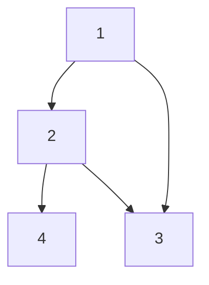
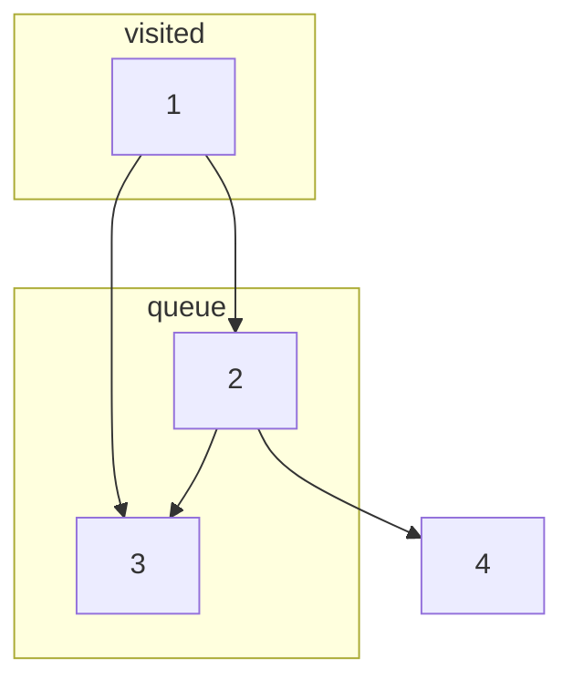
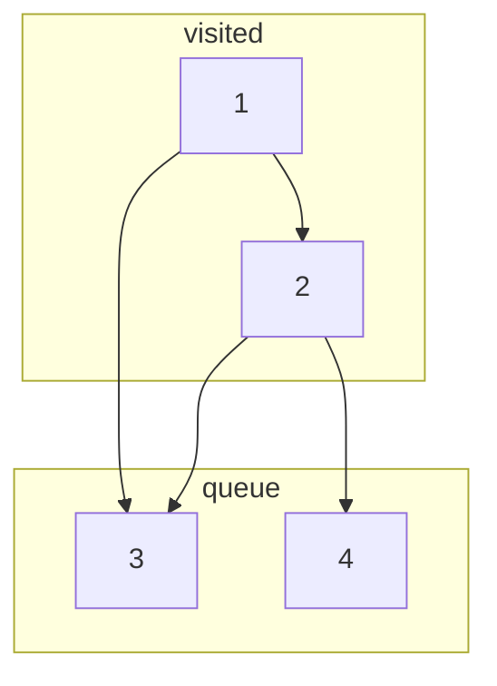
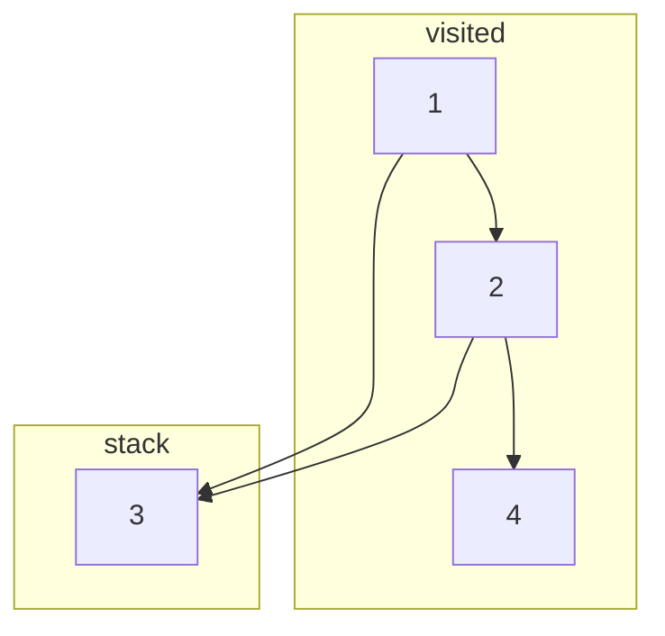
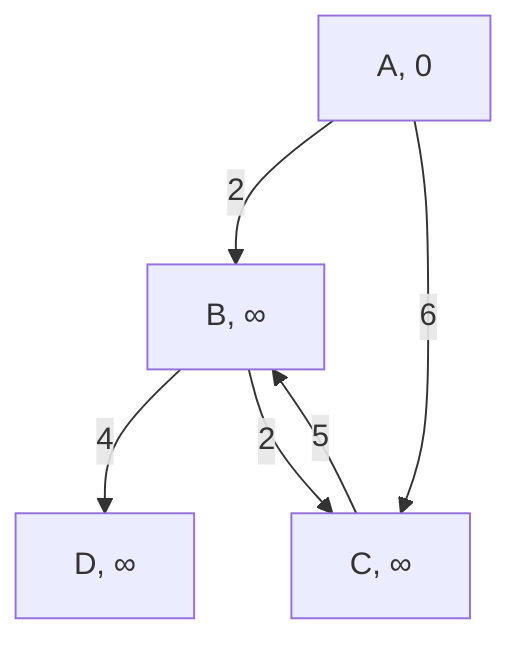
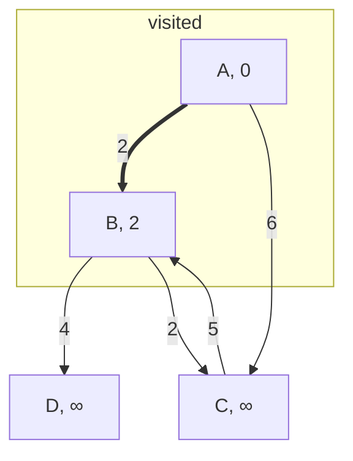
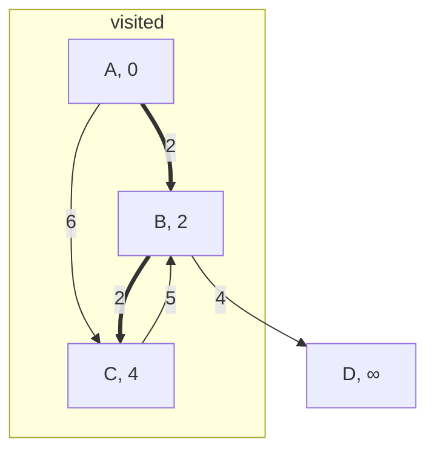
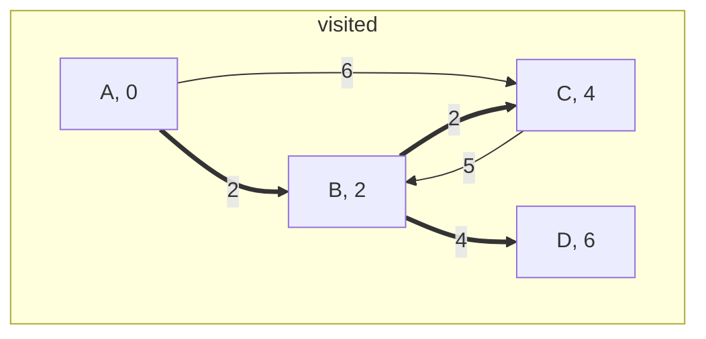

# Graph-Algorithms
Explanation and implementation of a bunch of different graph-related algorithms.

## Table of Contents
* [Graph Representation](#graph-representation)
    - [Vector of Vertices](#vector-of-vertices)
    - [Adjacency Matrix](#adjacency-matrix)
    - [Adjacency List](#adjacency-list)
    - [Edge List](#edge-list)
* [Traversal](#traversal)
    - [Breadth-Frst Search](#breadth-first-search)
    - [Depth-First Search](#depth-first-search)
* [Shortest Path](#shortest-path)
    - [Dijkstra](#dijkstra)
    - [Bellman-Ford](#bellman-ford)
    - [Floyd-Warshall](#floyd-warshall)
* [Topological Sorting](#topological-sorting)
    - [Using DFS](#using-dfs)
    - [Kahn's Algorithm](#kahns-algorithm)
* [Minimum Spanning Tree](#minimum-spanning-tree)
    - [Kruskal](#kruskal)
    - [Prim](#prim)
* [Strongly Connected Components](#strongly-connected-components)
    - [Tarjan's Algorithm](#tarjans-algorithm)


## Graph Representation
  A graph is a structure made up of vertices and edges. Vertices, also known as nodes, are connected through the edges. There are many ways to represent a graph in programming, and choosing the right one depends on your purpose. In the code of this repository, I will be using a vector composed of the nodes of the graph, where each node will be represented using a custom struct. However, there are also other ways to accomplish the same thing, each with its own advantages and disadvantages.

### Vector of Vertices
  A vector of vertices is what I am going to be using throughout this repository. Basically, I created a struct to act as a node which holds its value, a pointer to each neighbouring node as well as the weight of the edge connecting them and a way to add edges from one node to another. The code for the node is the following:
  
```c++
class Vertex {
    private:
        int value;
        std::vector<std::pair<Vertex*, int> > nextVertex;
    public:
        void val(int v) {
            value = v;
        }
        
        int val() {
            return value;
        }

        void add(Vertex* n, int w) {
            nextVertex.emplace_back(n, w);
        }

        Vertex* adj(int i) {
            return nextVertex[i].first;
        }

        int weight(int i) {
            return nextVertex[i].second;
        }

        int len() {
            return nextVertex.size();
        }
};
```

### Adjacency Matrix
  An adjacency matrix is basically a 2D board of size VxV where V is the amount of vertices present in the graph. A number is given to each vertex and the place [i][j] in the board symbolises that there is an edge connecting node i and j. In cases where the weight of all edges is constant then a simple 2D boolean board would be enough, however, in cases with varying weights it is necessary to replace booleans with some kind of data structure which holds only 2 values, which in C++ is the `std::pair`, one part of the pair would be a boolean and would decide whether there is a connection between the two nodes and the other value would be the weight. It is also possible to set some default value to the weight such as the max value of an integer with `std::numeric_limits<int>::max()`, therefore avoiding the need for a boolean.<br>
As I am using the vector of vertices, I created a function which converts such a structure to an adjacency matrix.
```c++
std::vector<std::vector<std::pair<bool, int> > > get_adjacency_matrix(std::vector<Vertex*> g) {
    std::vector<std::pair<bool, int> > temp(g.size(), std::make_pair(false, 0));
    std::vector<std::vector<std::pair<bool, int> > > r(g.size(), temp);
    for (int i = 0; i<g.size(); i++) {
        for (int j = 0; j<g[i]->len(); j++) {
            r[i][g[i]->adj(j)->val()] = std::make_pair(true, g[i]->weight(j));
        }
    }
    
    return r;
}
```
  While the adjacency matrix produced is much faster than any other structure which could be used as it offers constant look-up time, it lacks in the department of space complexity as it is $O(V^2)$, with V being the number of vertices.
  
### Adjacency List
An adjacency list consists of a list of vectors where each ith place in the list represents one vertex. In each slot, there is a vector which holds all of the neighbours by using the `std::pair` and holding the index of the node and the weight required to reach it. To transform from a vector of vertices to an adjacency list you could use the following code:
```c++
std::vector<std::vector<std::pair<int, int> > > get_adjacency_list(std::vector<Vertex*> g) {
    std::vector<std::vector<std::pair<int, int> > > r;
    for (int i = 0; i<g.size(); i++) {
        for (int j = 0; j<g[i]->len(); j++) {
            r[i].emplace_back(g[i]->adj(j)->val(), g[i]->weight(j));
        }
    }
    
    return r;
}
```
This method of storing a graph is quite efficient and actually pretty similar to the method used in this repository. Its lookup time is at worse $O(V)$, where V is the number of nodes, however, it is practically less and it is usually much more space-efficient than the adjacency matrix, with space complexity of $O(E)$, where E is the number of edges. Of course, E can be at worse equal to $V^2$, but usually, that is not the case. So even though the adjacency matrix and list may at first glance take up the same amount of space, the fact that the list version uses vectors with adjustable length contributes to an overall decrease in size by increasing some of its time complexity.

  ### Edge List
Finally, another popular method of storing graphs is the edge list. Basically, with this method you store in a list all of the edges present in the graph without caring about the nodes. Each edge in this list is represented by three values, two of them are the values of the two vertices connected and the final one is the weight of the edge. To accomplish this I just created another custom struct. The code for the conversion between the vector of vertices and the edge list is:
```c++
struct edge {
    int a, b, w;
};

std::vector<edge> get_edge_list(std::vector<Vertex*> g) {
    std::vector<edge> r;
    for (int i = 0; i<g.size(); i++) {
        for (int j = 0; j<g[i]->len(); j++) {
            edge e;
            e.a = g[i]->val();
            e.b = g[i]->adj(j)->val();
            e.w = g[i]->weight(j);
            r.push_back(e);
        }
    }
    std::sort(r.begin(), r.end(), [](const auto &a, const auto &b) {
        return a.w < b.w;
    });
    return r;
}
```
With this way of storing, nodes with no edges will be completely ignored, which is quite the drawback in certain cases and it even has a space and time complexity of $O(E)$, where E is the number of edges. However, its main strength stems from its easy-to-manipulate order of the edges, making it extremely useful in some cases such as in [Kruskal's Algorithm](#kruskal).

## Traversal
Graph traversal refers to the process of visiting all nodes in a graph. This process can be carried out for a multitude of reasons, such as searching for a specific node. Two of the most popular techniques in accomplishing this are Breadth-First Search and Depth-First Search.

### Breadth-First Search
Breadth-First Search, also known as BFS, is a traversal algorithm. It works by starting its search at a single node, marking it as visited, and then using a queue adds all unvisited neighbours of the node to the queue. Then, the next vertex is taken from the queue and the process repeats until the queue becomes empty. For instance, if we had the following graph:

If we call BFS on this graph, starting at node 1, then the algorithm will mark node 1 as visited and add node 2 and 3 to its queue.

Then it will access the queue. Let's say that node 2 was added first. That means that node 2 is marked as visited and then node 4 is added to the queue. However, node 3 has already been added to the queue and is therefore not added again. So the graph will now look like this:

Then, node 3 is accessed and marked as visited, however, it has no neighbours to add to the queue. Then, the loop runs again one final time for node 4 which is also marked as visited and with no neighbours to add and no other items on the queue, the BFS stops.<br>

With that algorithm in mind, we can now construct our program:
```c++
Vertex* bfs(Vertex *head, int key) {
    std::queue<Vertex*> q;
    q.push(head);
    std::unordered_map<Vertex*, bool> visited;
    while (!q.empty()) {
        Vertex* current = q.front();
        if (current->val() == key) return current;
        q.pop();
        if (visited[current]) continue;
        visited[current] = true;
        int l = current->len();
        for (int i = 0; i < l; i++) {
            Vertex* temp = current->adj(i);
            if (visited.find(temp) == visited.end()) {
                q.push(temp);
            }
        }
    }
    return nullptr;
}

```
The above algorithm uses BFS to search for a specific node with a value of `key`. The `head` is just the starting node passed on to it. It returns a pointer to the node if it is found, otherwise, it returns `nullptr`. The time complexity of the algorithm is $O(V+E)$, where V is the number of vertices and E is the number of edges. This is because each vertex is queued and dequeued only once and each edge is checked only once, giving us the above time complexity. When it comes to space complexity, the queue can hold at most V items which means that the space complexity is $O(V)$.

### Depth-First Search
Depth-First Search, also known as DFS, is a graph traversal algorithm very similar to BFS. However, instead of utilising a queue for storing the neighbours of the current vertex, it utilises a stack. So if we take the previous example, on the first loop the graph will be the same and on the second loop it will also go down node 2 so the graph will be similar:

However, now that a stack is being used, the next item which will be picked will not be node 3, but node 4. Therefore the graph will become:

And finally, node 3 will be checked and the program will be terminated.<br>
Because the only change made is for the queue to be swapped with a stack, we can simply take the previous BFS code and change it up a bit like so:
```c++
Vertex* dfs(Vertex *head, int key) {
    std::stack<Vertex*> q;
    q.push(head);
    std::unordered_map<Vertex*, bool> visited;
    while (!q.empty()) {
        Vertex* current = q.top();
        if (current->val() == key) return current;
        q.pop();
        if (visited[current]) continue;
        visited[current] = true;
        int l = current->len();
        for (int i = 0; i < l; i++) {
            Vertex* temp = current->adj(i);
            if (visited.find(temp) == visited.end()) {
                q.push(temp);
            }
        }
    }
    return nullptr;
}
```
Once again, the `key` represents the value that we are looking for and the `head` is the starting node. If the `key` is not found then `nullptr` will be returned. The time and space complexity of this DFS are the same as BFS, so the asymptotic time notation is $O(V+E)$ and the space complexity is $O(V)$, where V is the number of vertices and E is the number of edges. 
<br>
The two programs look almost identical and have the same time and space complexities, so what is the point in using one over the other? It's better to use BFS when the answer you are looking for is closer to the source node, whereas it is more optimal to use DFS when the answer lies somewhere quite far away from the source node. However, even then, most  people would rather go for DFS as its recursive solution is much easier to implement:
```c++
Vertex* dfs_recursive(Vertex *head, int key, std::unordered_map<Vertex*, bool>& visited) {
    if (head->val() == key) return head;
    if (visited[head]) return nullptr;
    visited[head] = true;
    int l = head->len();
    for (int i = 0; i < l; i++) {
        Vertex* temp = head->adj(i);
        if (visited.find(temp) == visited.end()) {
            Vertex* r = dfs_recursive(temp, key, visited);
            if (r != nullptr) return r;
        }
    }
    return nullptr;
}
```
Again, the way it works and the input it receives is the same as the iterative DFS, however, it has an extra parameter which is the visited map passed on as a reference. Its space and time complexity are the same, however, its space complexity does not come from the stack structure, but rather from the recursive calls. Of course, we can overload the function to exclude the third parameter from the first function call like so:
```c++
Vertex* dfs_recursive(Vertex *head, int key) {
    std::unordered_map<Vertex*, bool> visited;
    if (head->val() == key) return head;
    if (visited[head]) return nullptr;
    visited[head] = true;
    int l = head->len();
    for (int i = 0; i < l; i++) {
        Vertex* temp = head->adj(i);
        if (visited.find(temp) == visited.end()) {
            Vertex* r = dfs_recursive(temp, key, visited);
            if (r != nullptr) return r;
        }
    }
    return nullptr;
}
```

## Shortest Path
Shortest path algorithms are used to figure out, as the name suggests, the shortest path between two nodes on a graph. In cases where the weight of all of the edges is the same, a simple BFS would be enough to calculate the shortest path, however, with the addition of weights, such an approach is insufficient.

### Dijkstra
Dijkstra is a pathfinding algorithm which only works on graphs with non-negative weights. It closely resembles BFS, with the greatest change being the use of a heap instead of a queue. In C++, a heap can be used by utilizing `std::priority_queue`. A heap is a binary tree in which every parent node has the minimum/maximum value between their children. There are 2 types of heaps, max-heaps and min-heaps. Max-heaps have parents with maximum value whereas min-heaps have them with minimum value. In the case of Dijkstra, we will be using a min-heap. With heaps, you can access the minimum element of all of the items inserted in constant time. However, the addition of elements to the heap has an asymptotic time notation of $log(N)$, where N is the amount of items added.<br>
Dijkstra does not only find the shortest path from node A to B, but in reality, it finds the shortest path from a source node to all other nodes in a graph. The way it works is simple. The steps are described below:
1. Using a hash map or vector mark the source node as having a distance of 0 from the source and all other nodes as having infinite distance(to imply they are unvisited)
2. Push the source node to the priority queue together with the distance from the source node(0)
3. Use the priority queue to select the node closest to the source node
4. Mark the distance from the source node to this node as it has now been visited and the minimum distance has been found
5. Add all neighbours of the node to the priority queue together with their distance from the source Node
6. Repeat steps 3 - 5 until the priority queue is empty or the target node has been reached<br>

Basically, what happens in the above steps is that we add all neighbours of visited nodes to a priority queue together with the required distance to get to them from the source node by cumulating weights from the path required to get there. Then we pick the one with the least total distance and mark it as visited as we know there is no possible way to get back to this node with a lower total path. We then add those neighbours to the priority queue and continue.<br>
For example, let's say we have the following graph:

Let's say we are looking for the minimum distance between node A and D. If the source node is A, then we mark it as visited with a distance of 0 and we then push onto the priority queue its neighbours together with the weight required to get to them. The priority queue chooses the path to node B as it has a weight of 2. It is marked as visited with a distance from A of 2.

Then, we check B's neighbours. We push them onto the priority queue. We then access from the priority queue node C, which has a total distance from A being 4. 2 from A to B and 2 from B to C.

Then following the same logic we access the next node on the priority queue which is node D.

And like that, we found our target node, D, which requires a total distance of 6 to get to from node A.<br>

With that logic in mind, we can construct the following code:
```c++
int dijkstra(Vertex *head, int key) {
    std::priority_queue<std::pair<int, Vertex*>, std::vector<std::pair<int, Vertex*> >, std::greater<std::pair<int, Vertex*> > > q;
    q.push(std::make_pair(0, head));
    std::unordered_map<Vertex*, int> weights;
    while (!q.empty()) {
        Vertex* current = q.top().second;
        int weight = q.top().first;
        if (current->val() == key) return weight;
        q.pop();
        if (weight > weights[current]) break;
        weights[current] = weight;
        int l = current->len();
        for (int i = 0; i < l; i++) {
            Vertex* temp = current->adj(i);
            int w = current->weight(i);
            if (weights.find(temp) == weights.end() || weight+w < weights[temp]) {
                weights[temp] = weight+w;
                q.push(std::make_pair(weight+w, temp));
            }
        }
    }
    return -1;
}
```
The function above returns the total distance required to get from the source node(`head`) to the target with a value of `key`. If it fails to find an answer it simply returns -1. The time complexity of Dijkstra is $O((V+E)log(V))$, where V is the number of vertices and E is the number of edges. The reason behind this time complexity comes from the fact that each vertex will be extracted once from the priority queue, and we will have at most E amount of insertions in the priority queue. And since both of those operations take $O(log(V))$ time, then once multiplied by the number of times they are carried out, you get the above time complexity. That time complexity can be improved down to $O(V + E \times log(V))$ when updating the priority queue instead of adding an edge each time. And it can even be improved further by implementing a Fibonacci heap for the priority queue instead of a binary heap, leading to a $O(E + V \times log(V))$.

  ### Bellman-Ford

  ### Floyd-Warshall
  

  ## Topological Sorting

  ### Using DFS

  ### Kahn's Algorithm
  

  ## Minimum Spanning Tree

  ### Kruskal

  ### Prim
  

  ## Strongly Connected Components

  ### Tarjan's Algorithm


  
